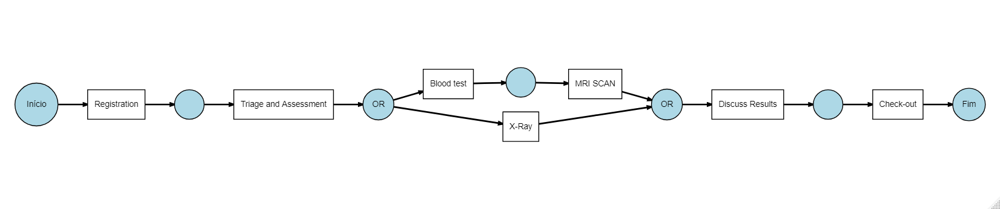
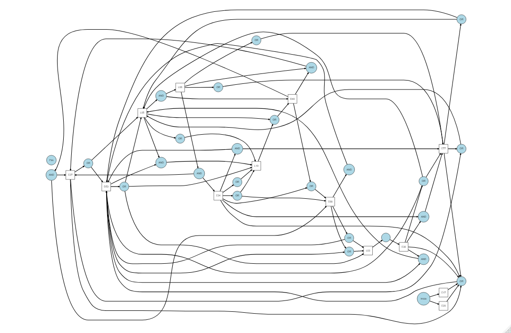
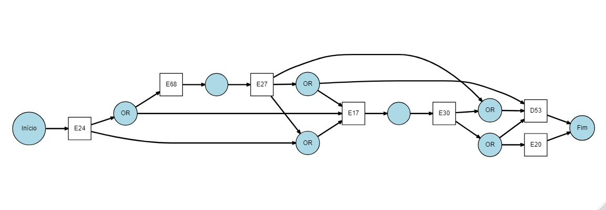

# Process Mining discovery algorithms

In this repo, I will store some own algorithms for process mining
discovery models. Feel free to use them for your projects and please,
let me know of your improvements.

## Alpha miner

This is my own implementation of the Alpha Miner algorithm.

``` {r}
require(DiagrammeR) 
require(dplyr) 
require(tidyr)
require(plyr) 
require(bupaR)

log <- patients

alpha_miner(log) 
```


It's well known that Alpha Miner has a weak point - it can't deal with noise in data. In this sense, I included an argument called `freq` that filters transitions in terms of frequency. So let's take a look at another event log:

```{r}
alpha_miner(log)
```


And now filtering transitions that has at least 1% of frequency:

```{r}
alpha_miner(log, freq = 0.01)
```

